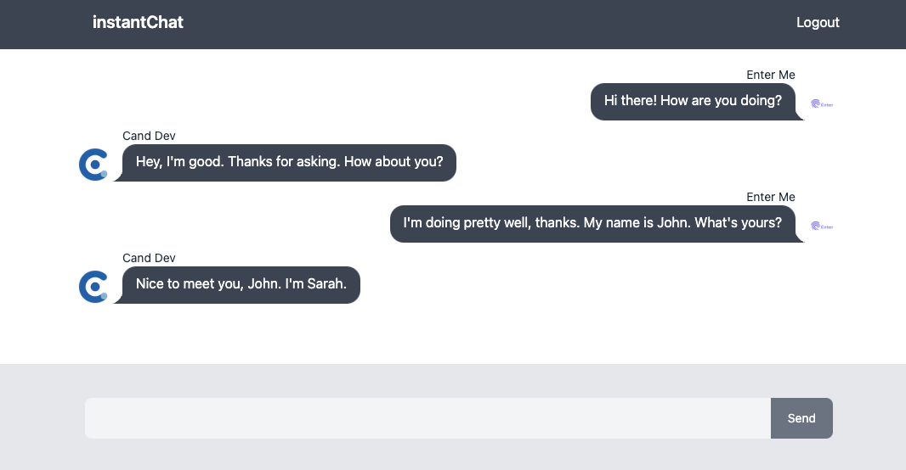

This project was bootstrapped with [vite](https://vitejs.dev/guide/#scaffolding-your-first-vite-project).

<ins>App Preview</ins>

## Environment Variables

To run this project, you will need to add the following environment variables to your .env file

`VITE_FIREBASE_API_KEY=<YOUR_FIREBASE_API_KEY>`
`VITE_FIREBASE_AUTH_DOMAIN=<YOUR_FIREBASE_AUTH_DOMAIN>`
`VITE_FIREBASE_PROJECT_ID=<YOUR_FIREBASE_PROJECT_ID>`
`VITE_FIREBASE_STORAGE_BUCKET=<YOUR_FIREBASE_STORAGE_BUCKET>`
`VITE_FIREBASE_MESSAGING_SENDER_ID=<YOUR_FIREBASE_MESSAGING_SENDER_ID>`
`VITE_FIREBASE_APP_ID=<YOUR_FIREBASE_APP_ID>`

## Available Scripts

In the project directory, you can run:

### `yarn`

Instal All dependencies in this project

### `yarn run dev`

Runs the app in the development mode. 
Open [http://127.0.0.1:5173](http://127.0.0.1:5173) to view it in the browser.

### Link

- Vite: https://vitejs.dev/
- DaisyUI: https://daisyui.com/
- Tailwind CSS: https://tailwindcss.com/docs/guides/vite
- Firebase Docs: https://firebase.google.com/docs
